# node-red-contrib-ibm-maximo-oslc-api

A [Node-RED](http://nodered.org) node wrapper for IBM Maximo Oslc Api requests.

## Install

Run the following command in your Node-RED installation folder
```bash
 $ npm install node-red-contrib-ibm-maximo-oslc-api
```

**Or**

Install using the Node-RED User Settings > Palette > Install, searching for **node-red-contrib-ibm-maximo-oslc-api**

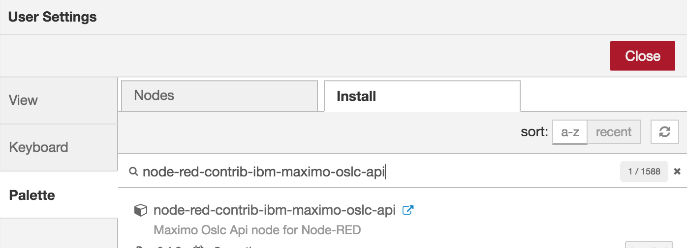

Once the plugin is installed, you should have 4 new nodes:

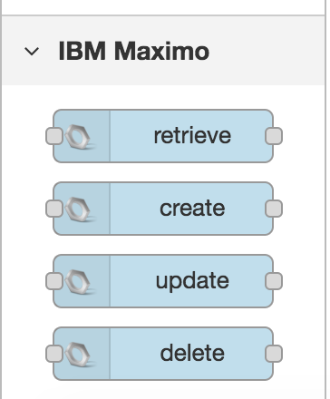

## How to Use

To use this plugin you must have a Maximo instance (version 7.6 or above), understand the Maximo Oslc Api and have an user with the right access to send api calls. That information can be found in [Maximo Nextgen Rest API](https://developer.ibm.com/static/site-id/155/maximodev/restguide/Maximo_Nextgen_REST_API.html)

### Maximo Connection

Every node has a **Maximo Connection** field which is used to select the Maximo Connection to be used when making the request

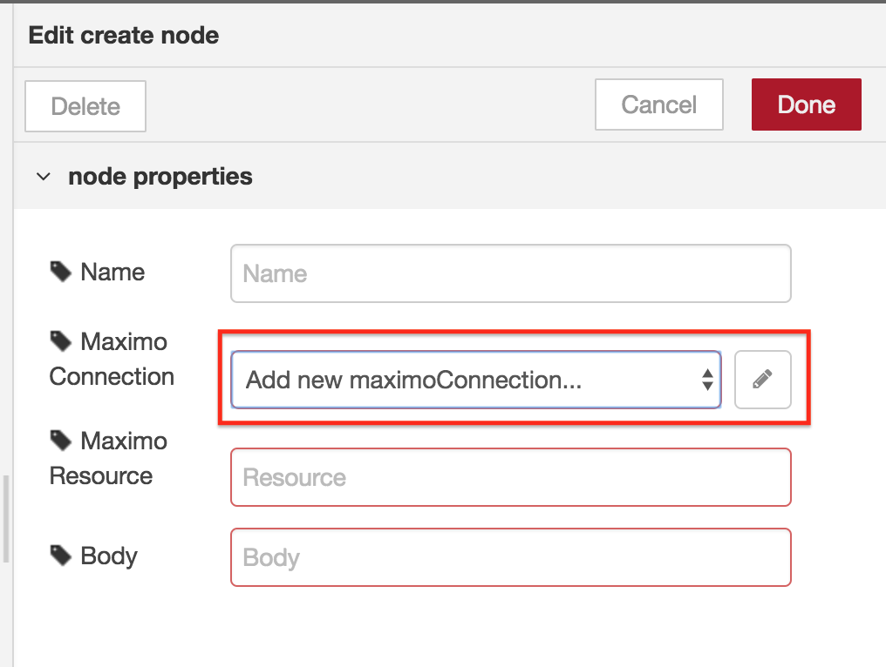

#### Creating a new connection

Click on the pencil button to create a new Maximo Connection

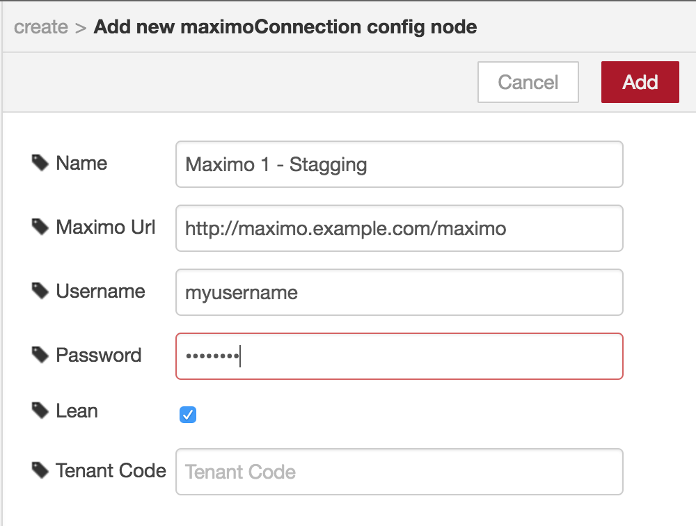

Where:
- **Name** is the connection name
- **Maximo Url** is the address to your Maximo instance
- **Username** and **Password** are the Maximo credentials
- **Lean** is a default option to make the responses without namespaces
- **Tenant Code** if your environment uses tenant codes, then you can specify which one you want to use

> Check if your user has the right permissions to make your requests

### Examples

#### Retrieving Service Requests

To get a list of Service Requests where the owner is **test@ibm.com** add a **retrieve** node to your flow:

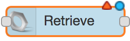

Double click to access the properties and fill the fields as in the image bellow:

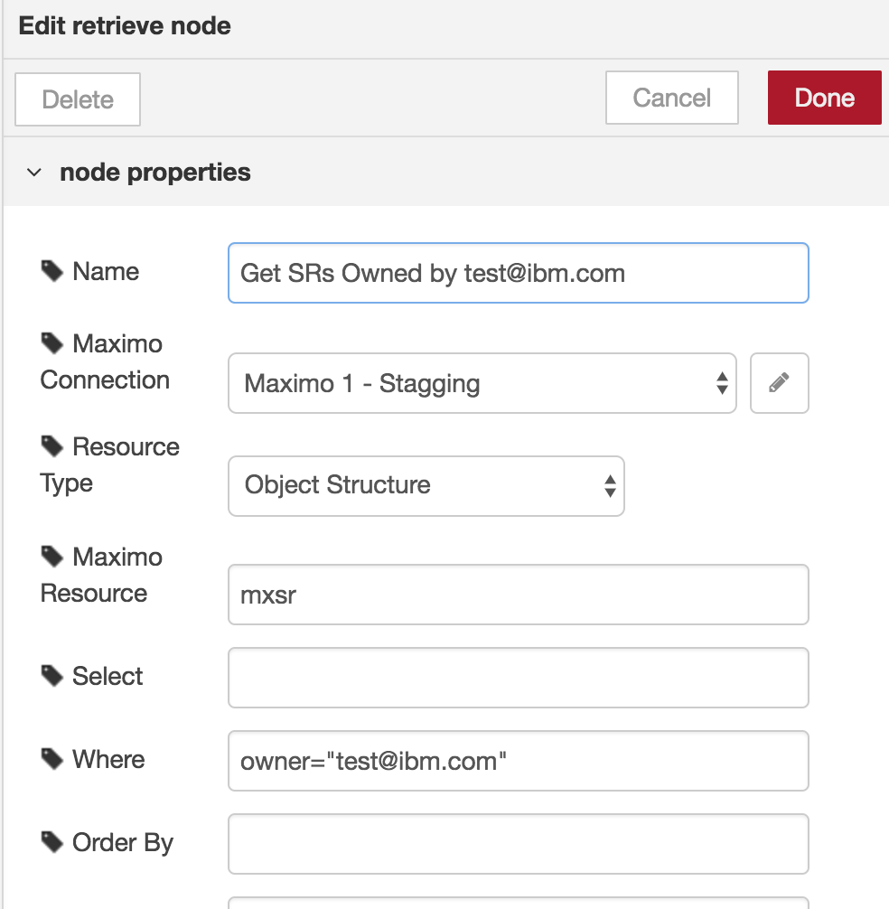

Where:
- **Name** is the display name. It will be shown in your flow
- **Maximo Connection** is the connection we created earlier
- **Resource Type** is related with the field **Maximo Resource**. For this example we will use the option *Object Structure*
- **Maximo Resource** in our case is mxsr. Mxsr is the object structure that deals with *Service Requests*. If you choose *Full Url* on **Resource Type** you can specify here the full url to the resource you want to retrieve
- **Where** is the where clause to our example
- **Page Size** (*not shown in the above image*) in our case we will limit the records returned to 10

You can specify other fields, for example **Select** to retrieve just the fields you want. See [Maximo Nextgen Rest API](https://developer.ibm.com/static/site-id/155/maximodev/restguide/Maximo_Nextgen_REST_API.html) for more details.

To test our example, we can add an injection node to the begining and a debug node (to show all message not just the payload) to the end of our flow:

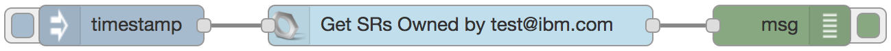

Now we can deploy and test our flow.

> Tip: Notice the node has changed to some states when running:
>- **Connecting** 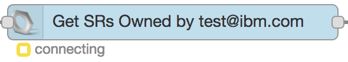
>- **Connected** 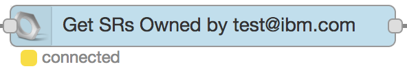
>- **Sending** 
>- **Retrieved** 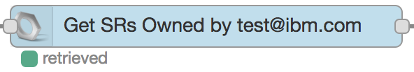
>
>Every node has this feature to make it easier to see what happened and debug

We can check the results on Debug tab:

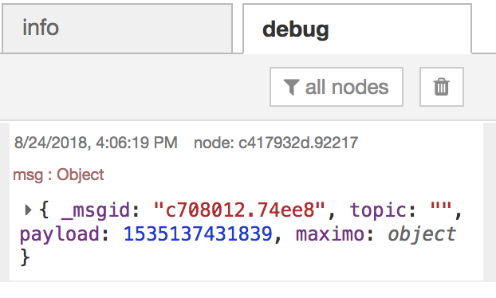

This is the entire message. You can use the payload in the next nodes or make your own validations using the built-in *function* node

The response will be in the **maximo.response.payload** object and will be equals to the data returned from Maximo (See [Maximo Nextgen Rest API](https://developer.ibm.com/static/site-id/155/maximodev/restguide/Maximo_Nextgen_REST_API.html) for more details)